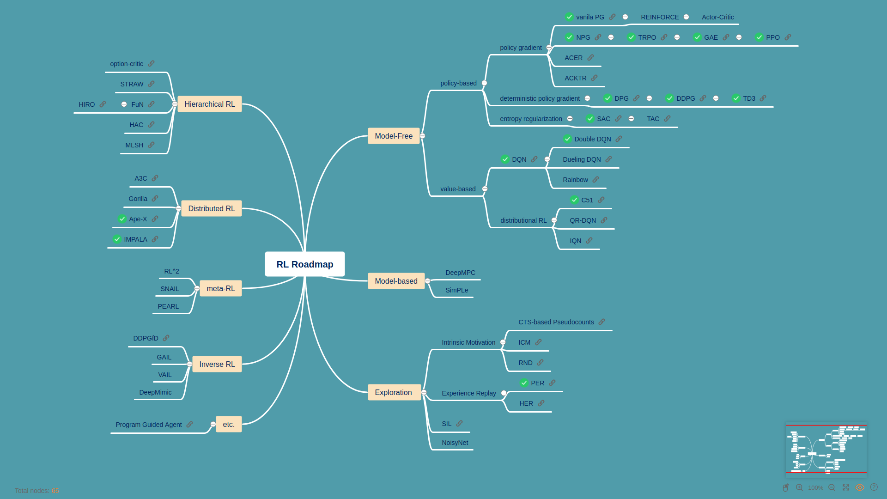

# rl-paper-review

### RL Roadmap

[`GITMIND`](https://gitmind.com/app/doc/e3a1343403) < Link!!

## Policy Gradient

### (1) Vanila PG(Sutton)

[Policy gradient methods for reinforcement learning with function approximation]

Richard S. Sutton, David McAllester, Satinder Singh, Yishay Mansour,1994

[`REVIEW`](./reviews/Sutton_PG.md)	|	[`PAPER`](http://papers.nips.cc/paper/1713-policy-gradient-methods-for-reinforcement-learning-with-function-approximation.pdf)

 

### (2) DPG

[Deterministic policy gradient algorithms]

Silver, D., Lever, G., Heess, N., Degris, T., Wierstra, D., & Riedmiller, M. (2014).

[`REVIEW`](./reviews/DPG.md)	|	[`PAPER`](http://proceedings.mlr.press/v32/silver14.pdf)

 

### (3) DDPG

[Continuous control with deep reinforcement learning]

Timothy P. Lillicrap∗ , Jonathan J. Hunt∗ , Alexander Pritzel, Nicolas Heess, Tom Erez, Yuval Tassa, David Silver & Daan Wierstra (2016)

[`REVIEW`](./reviews/DDPG.md)	|	[`PAPER`](https://arxiv.org/pdf/1509.02971.pdf)	|	[`CODE`](https://github.com/CUN-bjy/walkyto-ddpg)

 

### (4) NPG

[A natural policy gradient]

Sham Kakade(2002)

[`REVIEW`](./reviews/NPG.md)	|	[`PAPER`](https://papers.nips.cc/paper/2073-a-natural-policy-gradient.pdf)

 

### (5) TRPO

[Trust region policy optimization]

John Schulman, Sergey Levine, Philipp Moritz, Michael Jordan, Pieter Abbeel (2015)

[`REVIEW`](./reviews/TRPO.md) 	|	[`PAPER`](https://arxiv.org/pdf/1502.05477.pdf)

 

### (6) GAE

[High-Dimensional Continuous Control Using Generalized Advantage Estimation]

John Schulman, Philipp Moritz, Sergey Levine, Michael I. Jordan and Pieter Abbeel(2016)

[`REVIEW`](./reviews/GAE.md) 	|	[`PAPER`](https://arxiv.org/pdf/1506.02438.pdf)

 

### (7) PPO

[Proximal policy optimization algorithms]

John Schulman, Filip Wolski, Prafulla Dhariwal, Alec Radford, Oleg Klimov(2017)

[`REVIEW`](./reviews/PPO.md) 	|	[`PAPER`](https://arxiv.org/pdf/1707.06347.pdf)	|	[`CODE`](https://github.com/CUN-bjy/gym-ppo-keras)

 

### (8) ACER

[ACER: Sample Efficient Actor-Critic With Experience Replay]

`PAPER`

 

### (9) ACKTR

[Scalable trust-region method for deep reinforcement learning using Kronecker-factored approximation]

`REVIEW` 	|	[`PAPER`](https://arxiv.org/pdf/1708.05144.pdf)

 

### (10) SAC
[Soft Actor-Critic: Off-Policy Maximum Entropy Deep Reinforcement Learning with a Stochastic Actor]

`REVIEW` 	|	[`PAPER`](https://arxiv.org/pdf/1801.01290.pdf)

 

### (11) TD3

[Addressing Function Approximation Error in Actor-Critic Methods]

`REVIEW` 	|	[`PAPER`](https://arxiv.org/pdf/1802.09477.pdf)

 

### (12) C51(distributional aspect)

[A Distributional Perspective on Reinforcement Learning]

`REVIEW`	|	[`PAPER`](https://arxiv.org/pdf/1707.06887.pdf)

 

## Exploration

### (1) PER

[Prioritized Experience Replay]

Tom Schaul, John Quan, Ioannis Antonoglou and David Silver, Google DeepMind(2015)

[`REVIEW`](./reviews/PER.md)	|	[`PAPER`](https://arxiv.org/pdf/1511.05952.pdf) 

 

### (2) HER

[Hindsight Experience Replay, Marcin Andrychowicz]

Marcin Andrychowicz∗ , Filip Wolski, Alex Ray, Jonas Schneider, Rachel Fong, Peter Welinder, Bob McGrew, Josh Tobin, Pieter Abbeel , Wojciech Zaremba ,OpenAI(2018)

`REVIEW`	|	[`PAPER`](https://arxiv.org/pdf/1707.01495.pdf)

 

## Distributed RL

### (1) Ape-X

[Distributed Prioritized Experience Replay]

`REVIEW` 	|	[`PAPER`](https://arxiv.org/pdf/1803.00933.pdf)

 

### (2) IMPALA

[IMPALA: Scalable Distributed Deep-RL with Importance Weighted Actor-learner Architectures]

`REVIEW` 	|	[`PAPER`](https://arxiv.org/pdf/1802.01561.pdf)

 

## Hierarchical RL

### (1) Option-Critic

[The Option-Critic Architecture]

`PAPER`

 

### (2) MLSH

[Meta Learning Shared Hierarchies]

`PAPER`

 

## Meta RL / Multi-task RL

 

---

### Reference

[Key Papers in Deep RL](https://spinningup.openai.com/en/latest/spinningup/keypapers.html#id106)

[PG Travel Guide](https://reinforcement-learning-kr.github.io/2018/06/29/0_pg-travel-guide/)

[utilForever/rl-paper-study](https://github.com/utilForever/rl-paper-study)